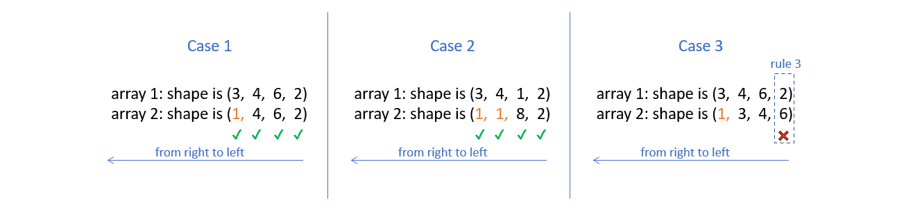

<h1 style="text-align: center;">NumPy Optimization: Vectorization and Broadcasting</h1>

This paper focuses on the optimisation of particle motion models, so it is mainly concerned with vectorisation and broadcasting in numpy optimisation. There are of course many other Numpy optimisations, but I won't go into them here.

## python loop

Suppose the code contains a looping section for a list, and since python is dynamically typed, this means that it doesn't know what types of objects are present in the list (whether integers, strings or floats).

As a result, Python must perform a series of checks at each iteration, such as determining the type of a variable, resolving its scope, checking for any invalid operations, etc. This causes Python loops to be relatively slow. 

If we compare with C. In C, arrays are allowed to consist of only one data type, which the compiler knows about in advance.

Of course there are many reasons why Python loops are relatively slow, but this is one of the main ones.


## Vectorization

In fact, most of the functions called in Python using NumPy are simply wrappers around the underlying code in C, where most of the heavy lifting happens. We can take advantage of this to speed up our code.

NumPy allows arrays to have only a single datatype and to store the data internally in contiguous blocks of memory, which allows NumPy to delegate most of the operations on such arrays to the underlying optimised pre-compiled C code. If NumPy could move the execution of loops to C, this would be much more efficient.

For example, for list_a and list_b below, suppose we need to multiply their corresponding elements, so there is a for loop here.


```python
list_a = [2,4,6,8,10,12,14,16,18,20]
list_b = [1,3,5,7,9,11,13,15,17,19]
```


```python
def multiply_py(list_a, list_b):
    for i in range(len(list_a)):
        list_a[i] * list_b[i]
```

Then the speed at which this function is run 100000 times and repeated 5 times each time is:


```python
%timeit -n 100000 -r 5 multiply_py(list_a, list_b)
```

    1.2 µs ± 117 ns per loop (mean ± std. dev. of 5 runs, 100000 loops each)
    

However, if use NumPy arrays, we don't need to write a loop, as shown below.


```python
import numpy as np

arr_a = np.array(list_a)
arr_b = np.array(list_b)

def multiply_np(arr_a, arr_b):
    arr_a * arr_b
```


```python
%timeit -n 100000 -r 5 multiply_np(arr_a, arr_b)
```

    612 ns ± 38.5 ns per loop (mean ± std. dev. of 5 runs, 100000 loops each)
    

We can see that the multiply_np function is much faster.

Notice this can be only done as the array enforces the elements of the array to be of the same kind. Otherwise, it would not be possible to convert the Python data types to native C ones to be executed under the hood.

## Broadcasting

### Concept

Broadcasting can help us vectorise loops of arrays of dissimilar sizes.

Take the following equation as an example.

arr_1 is a matrix containing 3 rows and 4 columns, suppose I want to make each column in arr_1 plus a column vector.

$$\begin{bmatrix}
0&1&2&3\\
4&5&6&7\\
8&9&10&11\\
\end{bmatrix}
+
\begin{bmatrix}
5\\
6\\
7\\
\end{bmatrix}
=
\begin{bmatrix}
5&6&7&8\\
10&11&12&13\\
15&16&17&18\\
\end{bmatrix}
$$

We translate it into code. As below, we need to follow the shape of arr_1 and do 4 loops to add arr_2 to each of its columns. This will make it inefficient due to the presence of loops.


```python
arr_1 = np.arange(12).reshape(3,4)
arr_2 = np.array([5,6,7])

def add_py(arr_1,arr_2):
    num_columns = arr_1.shape[1]
    for i in range(num_columns):
        arr_1[:, i] += arr_2
    return arr_1

add_py(arr_1,arr_2)
```


    array([[ 5,  6,  7,  8],
           [10, 11, 12, 13],
           [15, 16, 17, 18]])


```python
%timeit -n 100000 -r 5 add_py(arr_1,arr_2)
```

    6.8 µs ± 272 ns per loop (mean ± std. dev. of 5 runs, 100000 loops each)
    

We can make a matrix with the same size and the same columns as the original array, so that each column can be added at the same time to avoid loops.

$$\begin{bmatrix}
0&1&2&3\\
4&5&6&7\\
8&9&10&11\\
\end{bmatrix}
+
\begin{bmatrix}
5&5&5&5\\
6&6&6&6\\
7&7&7&7\\
\end{bmatrix}
=
\begin{bmatrix}
5&6&7&8\\
10&11&12&13\\
15&16&17&18\\
\end{bmatrix}
$$


```python
arr_1 = np.arange(12).reshape(3,4)
arr_2 = np.array([5,6,7])

def add_np(arr_1,arr_2):
    num_columns = arr_1.shape[1]
    add_matrix = np.array([arr_2,] * num_columns).T
    arr_1 += add_matrix
    return arr_1

add_np(arr_1,arr_2)
```


    array([[ 5,  6,  7,  8],
           [10, 11, 12, 13],
           [15, 16, 17, 18]])


```python
%timeit -n 100000 -r 5 add_np(arr_1,arr_2)
```

    4 µs ± 86.3 ns per loop (mean ± std. dev. of 5 runs, 100000 loops each)
    

### Rules of Broadcasting

This involves an important definition: the rank of the array in NumPy. The rank is the total number of dimensions of a NumPy array. For example, an array of shape (3, 4) has a rank of 2, and an array of shape (3, 4, 3) has a rank of 3.

1. To deem which two arrays are suitable for operations, NumPy compares the shape of the two arrays dimension-by-dimension starting from the trailing dimensions of the arrays working it's way forward.  (from right to left)


2. Two dimensions are said to be compatible if both of them are equal, or either one of them is 1.


3. If both the dimensions are unequal and neither of them is 1, then NumPy will throw an error and halt.

#### Arrays with Equal Ranks

For the following two cases we can try with code.


For the case on the left, it goes through without throwing an error.


```python
arr_a = np.random.rand(3,4,6,2) # random array of shape (3,4,6,2)
arr_b = np.random.rand(3, 4, 1, 2) 

arr_a + arr_b
```

For the case on the right, it throws an error.


```python
arr_a = np.random.rand(3, 4, 6, 2) # random array of shape (3,4,6,2)
arr_b = np.random.rand(3, 5, 1, 2)

arr_a + arr_b
```

#### Arrays with Unequal Ranks

For the following three cases.


In order to compare two such arrays, Numpy appends forward dimensions of size 1 to the smaller array so that it has a rank equal to the larger array. So all the comparisons above can be treated as (this is just a way to visualize what NumPy is doing, there is no appending internally):



## Optimisation of particle motion models

### An overview of this code

Firstly, I need to reintroduce our original python code again.


```python
import numpy as np

def simulation_py(n, iterations):
    p = particle_initial_position(n)
#    n = len(p)  # number of particles
    for _ in range(iterations):
        fs = np.zeros(shape=(n, 2))  # forces from all other particles
        
        for i in range(n):
            for j in range(n):
                if i != j:
                    r = p[j] - p[i]   #distence between particles,it's a vector.
                    dist = np.sqrt(np.sum(r**2))   #Converting distances to scalars
                    
                    with np.errstate(invalid='ignore'):
                        unit_vector_nan = r / dist    #unit vector,it's direction.
                    unit_vector = np.nan_to_num(unit_vector_nan)
                    
                    epsilon = 1  # parameter of LJ-potential
                    sigma = 0.1  # parameter of LJ-potential
                    
                    #Bringing the distance (scalar) and the parameters into the LJ equation gives the magnitude of the force (scalar)
                    with np.errstate(invalid='ignore'):
                        force_nan = 48 * epsilon * np.power(sigma, 12) / np.power(dist, 13) - 24 * epsilon * np.power(sigma, 6) / np.power(dist, 7)
                    force = np.nan_to_num(force_nan)
                    
                    fs[i] += -force * unit_vector    #Converting forces into vectors

        x_delta = fs / 1 * 0.00001    #Bring the force(vector) into the displacement equation and calculate the displacement(vector).

        p += x_delta    #update the position of particles

#    print("P({}):\n".format(iterations), p)   #plot finally result

    return p
```

We do a number of things here. 

First, the coordinates of the particles are subtracted one by one to find the distance between the particles "r" (vector), which is then converted to a scalar "dist" and decomposed into a direction vector "unit_vector".

Then, we take the "dist" into the LJ equation to find the magnitude of the force "force", and multiply the force by the direction vector "unit_vector" to convert it into a vector. 

Finally, we take this force into the displacement equation to find the displacement, and finally use it to update the original coordinates to get the new position of the particle after Δt time.

We give it an input: 50 particles and 100 iterations, and finally calculate its execution time:


```python
import timeit

# Generate n initial random particles
def particle_initial_position(n):
    np.random.seed(0)
    p = np.random.rand(n, 2)
    for i in range(n):
        while True:
            conflict = False
            for j in range(i):
                distance = np.linalg.norm(p[i] - p[j])
                if distance <= 0.1:
                    conflict = True
                    break
            if not conflict:
                break
            p[i] = np.random.rand(2)
    return p
```


```python
import timeit
compute_time_py = timeit.timeit(lambda: simulation_py(50, 100), number=1)
print("simulate_py execution time:", compute_time_py)
```

    simulate_py execution time: 23.53331849999995
    

### Optimisation methods

In this process we use a For loop, because we need to go through the elements of the particle coordinate matrix to find the distance between the coordinates, and then use the distance to calculate the force and displacement afterwards.

For example, we assume that there are 3 particles P1, P2, P3 and their coordinates are P1(3, 5), P2(2, 4), P3(7, 6).

$$\begin{bmatrix}
(3&5)\\
(2&4)\\
(7&6)\\
\end{bmatrix}$$


```python
def fixed_position():
    p = np.array([[3, 5], [2, 4], [7, 6]], dtype=np.float64)
    return p

fixed_position()
```


    array([[3., 5.],
           [2., 4.],
           [7., 6.]])


Firstly, for the first level of the loop we need to do this:

The distance from P1 to P1:
$$\begin{bmatrix}
(3&5)\\
\end{bmatrix}-\begin{bmatrix}
(3&5)\\
\end{bmatrix}=\begin{bmatrix}
(0&0)\\
\end{bmatrix}$$

The distance from P1 to P2:
$$\begin{bmatrix}
(3&5)\\
\end{bmatrix}-\begin{bmatrix}
(2&4)\\
\end{bmatrix}=\begin{bmatrix}
(1&1)\\
\end{bmatrix}$$

The distance from P1 to P3:
$$\begin{bmatrix}
(3&5)\\
\end{bmatrix}-\begin{bmatrix}
(7&6)\\
\end{bmatrix}=\begin{bmatrix}
(-4&-1)\\
\end{bmatrix}$$

But we can use Numpy's "broadcasting" to put this process into one matrix and compute it at the same time, which eliminates this layer of loop and makes it more performant. Like this:
$$\begin{bmatrix}
(3&5)\\
\end{bmatrix}-\begin{bmatrix}
(3&5)\\
(2&4)\\
(7&6)\\
\end{bmatrix}=\begin{bmatrix}
(0&0)\\
(1&1)\\
(-4&-1)\\
\end{bmatrix}$$

By the same principle, we can put the distances of the other particles to P1, P2 and P3 in the same matrix as follows:


then, we split it and it became:


In the code, we add a dimension to the original `r = p[j] - p[i]`, changing it to `rvs = (p[:, np.newaxis, :] - p[np.newaxis, :, :])`. So, the subsequent calculations are carried out as usual using this matrix with one more dimension, until we calculate the combined force, we need to add together the partial forces in the matrix `f_i = fs.sum(axis=1)`.

The modified code is as follows:


```python
np.seterr(divide='ignore', invalid='ignore')

def simulate_np(n, iterations):
    p = particle_initial_position(n)
    for _ in range(iterations):
        rvs = (p[:, np.newaxis, :] - p[np.newaxis, :, :])   #distence between particles,it's a vector.
        dist = np.sqrt(np.sum(rvs**2, axis=-1))    #Converting distances to scalars
        fs = np.zeros(shape=(n, 2))  # forces from all other particles

        dist_i = dist[:, :]
        rvs_i = rvs[:, :, :]

        with np.errstate(invalid='ignore'):
            unit_vectors_nan = rvs_i / dist_i[:, :, np.newaxis]
        unit_vectors = np.nan_to_num(unit_vectors_nan)

        dist_new = dist_i[:, :, np.newaxis]
        epsilon = 1  # parameter of LJ-potential
        sigma = 0.1  # parameter of LJ-potential
        with np.errstate(invalid='ignore'):
            fs_nan = 48 * epsilon * np.power(sigma, 12) / np.power(dist_new, 13)-24 * epsilon * np.power(sigma, 6) / np.power(dist_new, 7)
        fs = np.nan_to_num(fs_nan)*unit_vectors
                
        f_i = fs.sum(axis=1)
        x_delta = f_i / 1 * 0.00001
        
        p += x_delta    #update the position of particles

    #print("P({}):\n".format(iterations), p)    # plot finally result
    return p
```

We give it an input: 50 particles and 100 iterations, and finally calculate its execution time:


```python
compute_time_np = timeit.timeit(lambda: simulate_np(50, 100), number=1)

print("simulate_np execution time:", compute_time_np)
```

    simulate_np execution time: 0.09211789999972098
    

### Performance-comparison

Finally, let's create a table to compare how much the speed has increased.


```python
import pandas as pd
from IPython.display import HTML

data = {
    'Methods': ['Python', 'Numpy'],
    'Excution time(s)': [compute_time_py, compute_time_np],
    'Speed up': [1, compute_time_py/compute_time_np]
}
df = pd.DataFrame(data)

# Creating style functions
def add_border(val):
    return 'border: 1px solid black'

# Applying style functions to data boxes
styled_df = df.style.applymap(add_border)

# Defining CSS styles
table_style = [
    {'selector': 'table', 'props': [('border-collapse', 'collapse')]},
    {'selector': 'th, td', 'props': [('border', '1px solid black')]}
]

# Adding styles to stylised data boxes
styled_df.set_table_styles(table_style)

# Displaying stylised data boxes in Jupyter Notebook
HTML(styled_df.to_html())
```


<style type="text/css">
#T_05d2d table {
  border-collapse: collapse;
}
#T_05d2d th {
  border: 1px solid black;
}
#T_05d2d  td {
  border: 1px solid black;
}
#T_05d2d_row0_col0, #T_05d2d_row0_col1, #T_05d2d_row0_col2, #T_05d2d_row1_col0, #T_05d2d_row1_col1, #T_05d2d_row1_col2 {
  border: 1px solid black;
}
</style>
<table id="T_05d2d">
  <thead>
    <tr>
      <th class="blank level0" >&nbsp;</th>
      <th id="T_05d2d_level0_col0" class="col_heading level0 col0" >Methods</th>
      <th id="T_05d2d_level0_col1" class="col_heading level0 col1" >Excution time(s)</th>
      <th id="T_05d2d_level0_col2" class="col_heading level0 col2" >Speed up</th>
    </tr>
  </thead>
  <tbody>
    <tr>
      <th id="T_05d2d_level0_row0" class="row_heading level0 row0" >0</th>
      <td id="T_05d2d_row0_col0" class="data row0 col0" >Python</td>
      <td id="T_05d2d_row0_col1" class="data row0 col1" >23.533318</td>
      <td id="T_05d2d_row0_col2" class="data row0 col2" >1.000000</td>
    </tr>
    <tr>
      <th id="T_05d2d_level0_row1" class="row_heading level0 row1" >1</th>
      <td id="T_05d2d_row1_col0" class="data row1 col0" >Numpy</td>
      <td id="T_05d2d_row1_col1" class="data row1 col1" >0.092118</td>
      <td id="T_05d2d_row1_col2" class="data row1 col2" >255.469550</td>
    </tr>
  </tbody>
</table>


