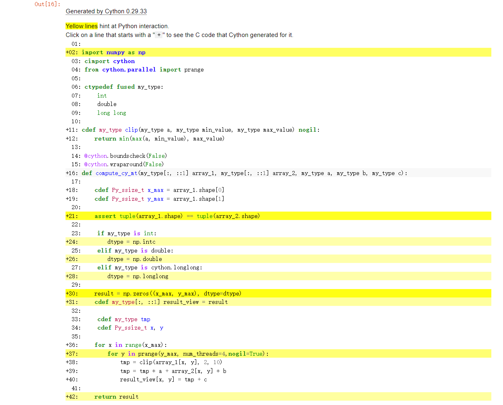

<h1 style="text-align: center;">How to speed up Numpy with Cython</h1>

# 1. Introduce
**This article will describe how to use Cython to speed up numpy.**

The original code using Nump is as follows, it truncates array_1 with the interval [2, 10] via np.clip. After that, we do some simple arithmetic with array_1, array_2 and a, b and c, and finally return the result of the calculation.


```python
def compute_np(array_1, array_2, a, b, c):
     return np.clip(array_1, 2, 10) * a + array_2 * b + c
```

# 2 Generating random arrays
**This is the prefix for all the code below, please run this prefix before running the program below.**

It will generate two random two-dimensional arrays and set the values of a,b,c. To make it easier to compare the speed of the runs later, the dimension of the arrays generated here is set larger, to (3000x2000).


```python
import numpy as np

array_1 = np.random.uniform(0, 100, size=(3000, 2000)).astype(np.intc)
array_2 = np.random.uniform(0, 100, size=(3000, 2000)).astype(np.intc)
a = 4
b = 3
c = 9
```

# 3. The code for the Nump

**The following code is executed by numpy.**

Here we name the function compute_np. We use timeit here to show how fast it runs, and to be more precise we calculate the average of its ten runs and record this length of time at the end with compute_np_time.


```python
import timeit

def compute_np(array_1, array_2, a, b, c):
     return np.clip(array_1, 2, 10) * a + array_2 * b + c

print(compute_np(array_1, array_2, a, b, c))

compute_np_time = timeit.timeit(lambda: compute_np(array_1, array_2, a, b, c), number=10)/10

print("compute_np execution time:", compute_np_time)
```

    [[ 85 127 241 ... 328  52 160]
     [196 160 343 ... 286 127 280]
     [169 109  94 ... 175 214 222]
     ...
     [253 163 325 ...  94 259 229]
     [133 308 190 ... 325 151 202]
     [178 331 281 ...  52 124 263]]
    compute_np execution time: 0.05866470000000845
    

# 4. The code for pure Python

**For numpy form, which cannot be translated directly into cython form, we first need to expand it into pure python form.**

Expands the above code into a pure python function. It loops through two dimensions for each element in array_1 and finally combines them together. This means that a new object needs to be assigned to each element used.Let's call it compute_py


```python
def clip(a, min_value, max_value):
    return min(max(a, min_value), max_value)

def compute_py(array_1, array_2, a, b, c):

    x_max = array_1.shape[0]
    y_max = array_1.shape[1]

    assert array_1.shape == array_2.shape

    result = np.zeros((x_max, y_max), dtype=array_1.dtype)

    for x in range(x_max):
        for y in range(y_max):
            tmp = clip(array_1[x, y], 2, 10)
            tmp = tmp * a + array_2[x, y] * b
            result[x, y] = tmp + c

    return result

print(compute_py(array_1, array_2, a, b, c))

compute_py_time = timeit.timeit(lambda: compute_py(array_1, array_2, a, b, c), number=10)/10

print("compute_py execution time:", compute_py_time)
```

    [[ 85 127 241 ... 328  52 160]
     [196 160 343 ... 286 127 280]
     [169 109  94 ... 175 214 222]
     ...
     [253 163 325 ...  94 259 229]
     [133 308 190 ... 325 151 202]
     [178 331 281 ...  52 124 263]]
    compute_py execution time: 10.784624809999878
    

## 4.1 Compare

Now, we can compare the speed of these two methods.

It is clear that the pure python is much slower than numpy.


```python
import pandas as pd
from IPython.display import HTML

data = {
    'Methods': ['Numpy', 'Pure Python'],
    'Speed(s)': [compute_np_time, compute_py_time],
    'Percentage(%)': [100, compute_np_time/compute_py_time*100]
}
df = pd.DataFrame(data)

# Creating style functions
def add_border(val):
    return 'border: 1px solid black'

# Applying style functions to data boxes
styled_df = df.style.applymap(add_border)

# Defining CSS styles
table_style = [
    {'selector': 'table', 'props': [('border-collapse', 'collapse')]},
    {'selector': 'th, td', 'props': [('border', '1px solid black')]}
]

# Adding styles to stylised data boxes
styled_df.set_table_styles(table_style)

# Displaying stylised data boxes in Jupyter Notebook
HTML(styled_df.to_html())
```


<style type="text/css">
#T_53ec3 table {
  border-collapse: collapse;
}
#T_53ec3 th {
  border: 1px solid black;
}
#T_53ec3  td {
  border: 1px solid black;
}
#T_53ec3_row0_col0, #T_53ec3_row0_col1, #T_53ec3_row0_col2, #T_53ec3_row1_col0, #T_53ec3_row1_col1, #T_53ec3_row1_col2 {
  border: 1px solid black;
}
</style>
<table id="T_53ec3">
  <thead>
    <tr>
      <th class="blank level0" >&nbsp;</th>
      <th id="T_53ec3_level0_col0" class="col_heading level0 col0" >Methods</th>
      <th id="T_53ec3_level0_col1" class="col_heading level0 col1" >Speed(s)</th>
      <th id="T_53ec3_level0_col2" class="col_heading level0 col2" >Percentage(%)</th>
    </tr>
  </thead>
  <tbody>
    <tr>
      <th id="T_53ec3_level0_row0" class="row_heading level0 row0" >0</th>
      <td id="T_53ec3_row0_col0" class="data row0 col0" >Numpy</td>
      <td id="T_53ec3_row0_col1" class="data row0 col1" >0.058665</td>
      <td id="T_53ec3_row0_col2" class="data row0 col2" >100.000000</td>
    </tr>
    <tr>
      <th id="T_53ec3_level0_row1" class="row_heading level0 row1" >1</th>
      <td id="T_53ec3_row1_col0" class="data row1 col0" >Pure Python</td>
      <td id="T_53ec3_row1_col1" class="data row1 col1" >10.784625</td>
      <td id="T_53ec3_row1_col2" class="data row1 col2" >0.543966</td>
    </tr>
  </tbody>
</table>


# 5. The code for Cython

## 5.1 Cython
Pure Python is also valid Cython code, so the same code can run in cython


```python
%load_ext cython
```


```cython
%%cython
import numpy as np
import timeit

array_1 = np.random.uniform(0, 100, size=(3000, 2000)).astype(np.intc)
array_2 = np.random.uniform(0, 100, size=(3000, 2000)).astype(np.intc)
a = 4
b = 3
c = 9

def clip(a, min_value, max_value):
    return min(max(a, min_value), max_value)

def compute_cy(array_1, array_2, a, b, c):

    x_max = array_1.shape[0]
    y_max = array_1.shape[1]

    assert array_1.shape == array_2.shape

    result = np.zeros((x_max, y_max), dtype=array_1.dtype)

    for x in range(x_max):
        for y in range(y_max):
            tmp = clip(array_1[x, y], 2, 10)
            tmp = tmp * a + array_2[x, y] * b
            result[x, y] = tmp + c

    return result

print(compute_cy(array_1, array_2, a, b, c))

compute_cy_time = timeit.timeit(lambda: compute_cy(array_1, array_2, a, b, c), number=10)/10

print("compute_cy execution time:", compute_cy_time)
```

    [[205  70 121 ... 130  64 304]
     [169 262  85 ... 295 232 181]
     [338 346  79 ... 295 100 139]
     ...
     [241 301 166 ... 193 235 289]
     [120 205 105 ... 223  85 103]
     [178  70  94 ... 109 130  55]]
    compute_cy execution time: 8.321111910000036
    

### 5.1.1 Compare

Because the C code still does exactly what the Python interpreter does, there's not much of a difference in speed.


```python
import pandas as pd

data = {
    'Methods': ['Numpy', 'Pure Python','Cython'],
    'Speed(s)': [compute_np_time, compute_py_time, compute_cy_time],
    'Percentage(%)': [100, compute_np_time/compute_py_time*100,compute_np_time/compute_cy_time*100]
}
df = pd.DataFrame(data)

# Creating style functions
def add_border(val):
    return 'border: 1px solid black'

# Applying style functions to data boxes
styled_df = df.style.applymap(add_border)

# Defining CSS styles
table_style = [
    {'selector': 'table', 'props': [('border-collapse', 'collapse')]},
    {'selector': 'th, td', 'props': [('border', '1px solid black')]}
]

# Adding styles to stylised data boxes
styled_df.set_table_styles(table_style)

# Displaying stylised data boxes in Jupyter Notebook
HTML(styled_df.to_html())
```


<style type="text/css">
#T_873e0 table {
  border-collapse: collapse;
}
#T_873e0 th {
  border: 1px solid black;
}
#T_873e0  td {
  border: 1px solid black;
}
#T_873e0_row0_col0, #T_873e0_row0_col1, #T_873e0_row0_col2, #T_873e0_row1_col0, #T_873e0_row1_col1, #T_873e0_row1_col2, #T_873e0_row2_col0, #T_873e0_row2_col1, #T_873e0_row2_col2 {
  border: 1px solid black;
}
</style>
<table id="T_873e0">
  <thead>
    <tr>
      <th class="blank level0" >&nbsp;</th>
      <th id="T_873e0_level0_col0" class="col_heading level0 col0" >Methods</th>
      <th id="T_873e0_level0_col1" class="col_heading level0 col1" >Speed(s)</th>
      <th id="T_873e0_level0_col2" class="col_heading level0 col2" >Percentage(%)</th>
    </tr>
  </thead>
  <tbody>
    <tr>
      <th id="T_873e0_level0_row0" class="row_heading level0 row0" >0</th>
      <td id="T_873e0_row0_col0" class="data row0 col0" >Numpy</td>
      <td id="T_873e0_row0_col1" class="data row0 col1" >0.058665</td>
      <td id="T_873e0_row0_col2" class="data row0 col2" >100.000000</td>
    </tr>
    <tr>
      <th id="T_873e0_level0_row1" class="row_heading level0 row1" >1</th>
      <td id="T_873e0_row1_col0" class="data row1 col0" >Pure Python</td>
      <td id="T_873e0_row1_col1" class="data row1 col1" >10.784625</td>
      <td id="T_873e0_row1_col2" class="data row1 col2" >0.543966</td>
    </tr>
    <tr>
      <th id="T_873e0_level0_row2" class="row_heading level0 row2" >2</th>
      <td id="T_873e0_row2_col0" class="data row2 col0" >Cython</td>
      <td id="T_873e0_row2_col1" class="data row2 col1" >8.321112</td>
      <td id="T_873e0_row2_col2" class="data row2 col2" >0.705010</td>
    </tr>
  </tbody>
</table>


### 5.1.2 Check

We can use %%cython -a, to generate html files.

As shown below, if a line is white, it means that the code generated doesn’t interact with Python, so will run as fast as normal C code. The darker the yellow, the more Python interaction there is in that line. Those yellow lines will usually operate on Python objects, raise exceptions, or do other kinds of higher-level operations than what can easily be translated into simple and fast C code.

So we can use it to check our code, and it lets us know what lines to improve so that it can run as fast as C.


## 5.2 Add Types

The first thing we need to do is define the type, we named it **compute_cy_t**. This means that the object passed will be converted to a C type.

With the results we can see that the speed has improved compared to the previous.


```cython
%%cython --compile-args=-O3

import numpy as np
import timeit

array_1 = np.random.uniform(0, 100, size=(3000, 2000)).astype(np.intc)
array_2 = np.random.uniform(0, 100, size=(3000, 2000)).astype(np.intc)
a = 4
b = 3
c = 9

DTYPE = np.intc   # numpy.intc ---- int. Otherwise,they are implicitly typed as Python objects

cdef int clip(int a, int min_value, int max_value):
    return min(max(a, min_value), max_value)


def compute_cy_t(array_1, array_2, int a, int b, int c):
    cdef Py_ssize_t x_max = array_1.shape[0]
    cdef Py_ssize_t y_max = array_1.shape[1]
    
    assert array_1.shape == array_2.shape
    assert array_1.dtype == DTYPE
    assert array_2.dtype == DTYPE

    result = np.zeros((x_max, y_max), dtype=DTYPE)
    
    cdef int tmp

    cdef Py_ssize_t x, y

    for x in range(x_max):
        for y in range(y_max):

            tmp = clip(array_1[x, y], 2, 10)
            tmp = tmp * a + array_2[x, y] * b
            result[x, y] = tmp + c

    return result

print(compute_cy_t(array_1, array_2, a, b, c))

compute_cy_t_time = timeit.timeit(lambda: compute_cy_t(array_1, array_2, a, b, c), number=10)/10

print("compute_cy_t execution time:", compute_cy_t_time)
```

    [[100 250 319 ...  63 334 283]
     [191 250 172 ... 346 136 240]
     [298 337 281 ... 139 106 115]
     ...
     [238  97 166 ...  73  70 250]
     [127 289 226 ... 196  73 256]
     [109 217 163 ...  21  41 160]]
    compute_cy_t execution time: 5.123431210000126
    

## 5.3 Efficient indexing with memoryviews

Adding types does make the code faster, but not nearly as fast as Numpy.

array_1 and array_2 are still NumPy arrays, so Python objects, and expect Python integers as indexes.
```
tmp = clip(array_1[x, y], 2, 10)\
tmp = tmp * a + array_2[x, y] * b
result[x, y] = tmp + c
```
Here we pass C int values. So every time Cython reaches this line, it has to convert all the C integers to Python int objects. Since this line is called very often, it outweighs the speed benefits of the pure C loops that were created from the range() earlier.

Furthermore, tmp * a + array_2[x, y] * b returns a Python integer and tmp is a C integer, so Cython has to do type conversions again. In the end those types conversions add up. And made our computation really slow. But this problem can be solved easily by using memoryviews.

memoryviews are C structures that can hold a pointer to the data of a NumPy array and all the necessary buffer metadata to provide efficient and safe access: dimensions, strides, item size, item type information, etc… They also support slices, so they work even if the NumPy array isn’t contiguous in memory. They can be indexed by C integers, thus allowing fast access to the NumPy array data.

Here is how to declare a memoryview of integers:
```
cdef int [:] foo         # 1D memoryview
cdef int [:, :] foo      # 2D memoryview
cdef int [:, :, :] foo   # 3D memoryview
```
Here is how to use them in our code,we named it **compute_cy_m**:


```cython
%%cython

import numpy as np
import timeit

array_1 = np.random.uniform(0, 100, size=(3000, 2000)).astype(np.intc)
array_2 = np.random.uniform(0, 100, size=(3000, 2000)).astype(np.intc)
a = 4
b = 3
c = 9

DTYPE = np.intc   # numpy.intc ---- int. Otherwise,they are implicitly typed as Python objects

cdef int clip(int a, int min_value, int max_value):
    return min(max(a, min_value), max_value)

def compute_cy_m(int[:, :] array_1, int[:, :] array_2, int a, int b, int c):
     
    cdef Py_ssize_t x_max = array_1.shape[0]
    cdef Py_ssize_t y_max = array_1.shape[1]

    assert tuple(array_1.shape) == tuple(array_2.shape)

    result = np.zeros((x_max, y_max), dtype=DTYPE)
    cdef int[:, :] result_view = result

    cdef int tmp
    cdef Py_ssize_t x, y

    for x in range(x_max):
        for y in range(y_max):

            tmp = clip(array_1[x, y], 2, 10)
            tmp = tmp * a + array_2[x, y] * b
            result_view[x, y] = tmp + c

    return result

print(compute_cy_m(array_1, array_2, a, b, c))

compute_cy_m_time = timeit.timeit(lambda: compute_cy_m(array_1, array_2, a, b, c), number=10)/10

print("compute_cy_m execution time:", compute_cy_m_time)
```

    [[235 173 139 ... 133  82 286]
     [301 322 256 ...  91  36 235]
     [343  85 235 ... 317 283 190]
     ...
     [ 55  76 253 ... 193 217 235]
     [292 238 292 ... 199 103 301]
     [133 124 289 ...  68 232 310]]
    compute_cy_m execution time: 0.037777249999999186
    

Here we can see how much faster it has become。

## 5.2 Tuning indexing further

The array lookups are still slowed down by two factors:

Bounds checking is performed.

Negative indices are checked for and handled correctly. The code above is explicitly coded so that it doesn’t use negative indices, and it (hopefully) always access within bounds.

With decorators, we can deactivate those checks:
```
...
cimport cython
@cython.boundscheck(False)  # Deactivate bounds checking
@cython.wraparound(False)   # Deactivate negative indexing.
def compute(int[:, :] array_1, int[:, :] array_2, int a, int b, int c):
...
```
Note that these lines of code are to be placed above the specified function, not at the beginning.Here we named it **compute_cy_i**.


```cython
%%cython

import numpy as np
import timeit


array_1 = np.random.uniform(0, 100, size=(3000, 2000)).astype(np.intc)
array_2 = np.random.uniform(0, 100, size=(3000, 2000)).astype(np.intc)
a = 4
b = 3
c = 9

DTYPE = np.intc   # numpy.intc ---- int. Otherwise,they are implicitly typed as Python objects

cdef int clip(int a, int min_value, int max_value):
    return min(max(a, min_value), max_value)

cimport cython
@cython.boundscheck(False)  # Deactivate bounds checking.
@cython.wraparound(False)   # Deactivate negative indexing.

def compute_cy_i(int[:, :] array_1, int[:, :] array_2, int a, int b, int c):
     
    cdef Py_ssize_t x_max = array_1.shape[0]
    cdef Py_ssize_t y_max = array_1.shape[1]

    assert tuple(array_1.shape) == tuple(array_2.shape)

    result = np.zeros((x_max, y_max), dtype=DTYPE)
    cdef int[:, :] result_view = result

    cdef int tmp
    cdef Py_ssize_t x, y

    for x in range(x_max):
        for y in range(y_max):

            tmp = clip(array_1[x, y], 2, 10)
            tmp = tmp * a + array_2[x, y] * b
            result_view[x, y] = tmp + c

    return result

print(compute_cy_i(array_1, array_2, a, b, c))

compute_cy_i_time = timeit.timeit(lambda: compute_cy_i(array_1, array_2, a, b, c), number=10)/10

print("compute_cy_i execution time:", compute_cy_i_time)
```

    [[187 259  94 ...  79 190 142]
     [154 178 175 ... 304 217 307]
     [106 331 346 ... 313 103 130]
     ...
     [ 85 280 313 ... 208  73  85]
     [298 256  85 ... 274 260 247]
     [ 82 322 244 ... 241 157 181]]
    compute_cy_i execution time: 0.014358759999959147
    

## 5.3 Declaring the NumPy arrays as contiguous

For extra speed gains, if you know that the NumPy arrays you are providing are contiguous in memory, you can declare the memoryview as contiguous.

We give an example on an array that has 3 dimensions. If you want to give Cython the information that the data is C-contiguous you have to declare the memoryview like this:
```
cdef int [:,:,::1] a
```
If you want to give Cython the information that the data is Fortran-contiguous you have to declare the memoryview like this:
```
cdef int [::1, :, :] a
```
If all this makes no sense to you, you can skip this part, declaring arrays as contiguous constrains the usage of your functions as it rejects array slices as input. 

Here we named it **compute_cy_c**.


```cython
%%cython 

import numpy as np
import timeit


array_1 = np.random.uniform(0, 100, size=(3000, 2000)).astype(np.intc)
array_2 = np.random.uniform(0, 100, size=(3000, 2000)).astype(np.intc)
a = 4
b = 3
c = 9

DTYPE = np.intc   # numpy.intc ---- int. Otherwise,they are implicitly typed as Python objects

cdef int clip(int a, int min_value, int max_value):
    return min(max(a, min_value), max_value)

cimport cython
@cython.boundscheck(False)  # Deactivate bounds checking.
@cython.wraparound(False)   # Deactivate negative indexing.

def compute_cy_c(int[:, ::1] array_1, int[:, ::1] array_2, int a, int b, int c):
     
    cdef Py_ssize_t x_max = array_1.shape[0]
    cdef Py_ssize_t y_max = array_1.shape[1]

    assert tuple(array_1.shape) == tuple(array_2.shape)

    result = np.zeros((x_max, y_max), dtype=DTYPE)
    cdef int[:, ::1] result_view = result

    cdef int tmp
    cdef Py_ssize_t x, y

    for x in range(x_max):
        for y in range(y_max):

            tmp = clip(array_1[x, y], 2, 10)
            tmp = tmp * a + array_2[x, y] * b
            result_view[x, y] = tmp + c

    return result

print(compute_cy_c(array_1, array_2, a, b, c))

compute_cy_c_time = timeit.timeit(lambda: compute_cy_c(array_1, array_2, a, b, c), number=10)/10

print("compute_cy_c execution time:", compute_cy_c_time)
```

    [[283 109 244 ...  58  61 328]
     [ 85 142 331 ... 145 346 259]
     [202 235 109 ... 169 280  52]
     ...
     [325 232 271 ... 151  87 202]
     [ 52  73 295 ... 247 235 286]
     [232 268 127 ... 196 136 211]]
    compute_cy_c execution time: 0.014614970000002359
    

Obviously, this optimization doesn't work here.

## 5.4 Making the function cleaner & Use of multiple data types

Declaring types can make your code quite verbose. If you don’t mind Cython inferring the C types of your variables, you can use the following compiler directive at the top of the file. It will save you quite a bit of typing.
```
infer_types=True
```
Note that since type declarations must happen at the top indentation level, Cython won’t infer the type of variables declared for the first time in other indentation levels. It would change too much the meaning of our code. This is why, we must still declare manually the type of the tmp, x and y variable.

And actually, manually giving the type of the tmp variable will be useful when using fused types.

All those speed gains are nice, but adding types constrains our code. At the moment, it would mean that our function can only work with NumPy arrays with the np.intc type.

So we can use fused types to make our code work with multiple NumPy data types. The code is as follows:
```
ctypedef fused my_type:
    int
    double
    long long
```
It is similar to a C++ template. It generates multiple function declarations at compile time and then selects the correct function at runtime based on the types of arguments provided. By comparing the types in the if-conditions, it is also possible to execute a completely different code path depending on the specific data type.

In our example, since we can no longer access the dtype of NumPy's input array, we use these if-else statements to know what NumPy data type should be used for our output array.

In this case, our function now applies to ints, doubles and floats.Here we named it **compute_cy_mdt**.


```cython
%%cython 

# cython: infer_types=True
import numpy as np
import timeit
cimport cython

array_1 = np.random.uniform(0, 100, size=(3000, 2000)).astype(np.intc)
array_2 = np.random.uniform(0, 100, size=(3000, 2000)).astype(np.intc)
a = 4
b = 3
c = 9

ctypedef fused my_type:
    int
    double
    long long

cdef my_type clip(my_type a, my_type min_value, my_type max_value):
    return min(max(a, min_value), max_value)

@cython.boundscheck(False)
@cython.wraparound(False)
def compute_cy_mdt(my_type[:, ::1] array_1, my_type[:, ::1] array_2, my_type a, my_type b, my_type c):
     
    x_max = array_1.shape[0]
    y_max = array_1.shape[1]
    
    assert tuple(array_1.shape) == tuple(array_2.shape)

    if my_type is int:
        dtype = np.intc
    elif my_type is double:
        dtype = np.double
    elif my_type is cython.longlong:
        dtype = np.longlong

    result = np.zeros((x_max, y_max), dtype=dtype)
    cdef my_type[:, ::1] result_view = result

    cdef my_type tmp
    cdef Py_ssize_t x, y

    for x in range(x_max):
        for y in range(y_max):

            tmp = clip(array_1[x, y], 2, 10)
            tmp = tmp * a + array_2[x, y] * b
            result_view[x, y] = tmp + c

    return result

print(compute_cy_mdt(array_1, array_2, a, b, c))

compute_cy_mdt_time = timeit.timeit(lambda: compute_cy_mdt(array_1, array_2, a, b, c), number=10)/10

print("compute_cy_mdt execution time:", compute_cy_mdt_time)
```

    [[109 337 268 ...  55 316 184]
     [226 157 310 ... 274 273 258]
     [256 328  61 ...  82 241 259]
     ...
     [154 274 328 ... 340 262 217]
     [304 100  55 ... 256 334 148]
     [ 58 170 289 ... 226 274  91]]
    compute_cy_mdt execution time: 0.014951370000017051
    

## 5.5 Using multiple threads

Cython has support for OpenMP. It also has some nice wrappers around it, like the function prange(). 

The GIL must be released, so this is why we declare our clip() function nogil.

Here we named it **compute_cy_mt.**

**Note:**
The important thing to note here is that we need to open openmp, this may be different for different operating systems, I'm running this on windows so here is: -c=/openmp


```cython
%%cython --force -c=/openmp
# tag: openmp
# You can ignore the previous line.
# It's for internal testing of the cython documentation.

# distutils: extra_compile_args=-fopenmp
# distutils: extra_link_args=-fopenmp

import numpy as np
import timeit
cimport cython
from cython.parallel import prange

array_1 = np.random.uniform(0, 100, size=(3000, 2000)).astype(np.intc)
array_2 = np.random.uniform(0, 100, size=(3000, 2000)).astype(np.intc)
a = 4
b = 3
c = 9

ctypedef fused my_type:
    int
    double
    long long


# We declare our plain c function nogil
cdef my_type clip(my_type a, my_type min_value, my_type max_value) nogil:
    return min(max(a, min_value), max_value)


@cython.boundscheck(False)
@cython.wraparound(False)
def compute_cy_mt(my_type[:, ::1] array_1, my_type[:, ::1] array_2, my_type a, my_type b, my_type c):

    cdef Py_ssize_t x_max = array_1.shape[0]
    cdef Py_ssize_t y_max = array_1.shape[1]

    assert tuple(array_1.shape) == tuple(array_2.shape)

    if my_type is int:
        dtype = np.intc
    elif my_type is double:
        dtype = np.double
    elif my_type is cython.longlong:
        dtype = np.longlong

    result = np.zeros((x_max, y_max), dtype=dtype)
    cdef my_type[:, ::1] result_view = result

    cdef my_type tmp
    cdef Py_ssize_t x, y

    # We use prange here.
    # for x in prange(x_max, nogil=True):
    #     for y in range(y_max):
    for x in range(x_max):
        for y in prange(y_max, num_threads=4,nogil=True):
            tmp = clip(array_1[x, y], 2, 10)
            tmp = tmp * a + array_2[x, y] * b
            result_view[x, y] = tmp + c

    return result

print(compute_cy_mt(array_1, array_2, a, b, c))

compute_cy_mt_time = timeit.timeit(lambda: compute_cy_mt(array_1, array_2, a, b, c), number=10)/10

print("compute_cy_mt execution time:", compute_cy_mt_time)
```

    [[274 322 337 ... 280 192 262]
     [130 200 277 ... 121 307 304]
     [ 76 124  59 ... 184 256 265]
     ...
     [169  38 340 ... 175 247 328]
     [325 337 319 ... 180 328 283]
     [252  97 285 ... 193  69 169]]
    compute_cy_mt execution time: 0.04007001999998465
    

Parallel computing does not necessarily lead to an eventual speed increase, and the reasons for this can be varied. For example, Parallelizing operations incurs additional overhead, such as thread creation and synchronization, that may outweigh the benefits of parallelism for small or simple operations.

Here, instead, I am running slower, which could be that this example is not applicable to parallel computing or is not adapted to my hardware.

# 6 Summarize

 ## 6.1 html file
 
 The final html file is as follows. Most of the lines have become lighter in colour, even white.



## 6.2 Compare

Finally let's compare their speeds. If we look at Numpy's speed as 100%, then the last column is their comparison with the very first Numpy speed.


```python
import pandas as pd
from IPython.display import HTML

data = {
    'Methods': ['Numpy', 'Pure Python','Original Cython','Cython_add types','Cython_memoryviews','Cython_tuning indexing','Cyton_contiguous','Cython_multiple data types','Cython_multiple threads'],
    'Speed(s)': [compute_np_time, compute_py_time,compute_cy_time,compute_cy_t_time,compute_cy_m_time,compute_cy_i_time,compute_cy_c_time,compute_cy_mdt_time,compute_cy_mt_time],
    'Percentage(%)': [100, compute_np_time/compute_py_time*100,compute_np_time/compute_cy_time*100,compute_np_time/compute_cy_t_time*100,compute_np_time/compute_cy_m_time*100,compute_np_time/compute_cy_i_time*100,compute_np_time/compute_cy_c_time*100,compute_np_time/compute_cy_mdt_time*100,compute_np_time/compute_cy_mt_time*100]
}
df = pd.DataFrame(data)

# Creating style functions
def add_border(val):
    return 'border: 1px solid black'

# Applying style functions to data boxes
styled_df = df.style.applymap(add_border)

# Defining CSS styles
table_style = [
    {'selector': 'table', 'props': [('border-collapse', 'collapse')]},
    {'selector': 'th, td', 'props': [('border', '1px solid black')]}
]

# Adding styles to stylised data boxes
styled_df.set_table_styles(table_style)

# Displaying stylised data boxes in Jupyter Notebook
HTML(styled_df.to_html())
```


<style type="text/css">
#T_0de2c table {
  border-collapse: collapse;
}
#T_0de2c th {
  border: 1px solid black;
}
#T_0de2c  td {
  border: 1px solid black;
}
#T_0de2c_row0_col0, #T_0de2c_row0_col1, #T_0de2c_row0_col2, #T_0de2c_row1_col0, #T_0de2c_row1_col1, #T_0de2c_row1_col2, #T_0de2c_row2_col0, #T_0de2c_row2_col1, #T_0de2c_row2_col2, #T_0de2c_row3_col0, #T_0de2c_row3_col1, #T_0de2c_row3_col2, #T_0de2c_row4_col0, #T_0de2c_row4_col1, #T_0de2c_row4_col2, #T_0de2c_row5_col0, #T_0de2c_row5_col1, #T_0de2c_row5_col2, #T_0de2c_row6_col0, #T_0de2c_row6_col1, #T_0de2c_row6_col2, #T_0de2c_row7_col0, #T_0de2c_row7_col1, #T_0de2c_row7_col2, #T_0de2c_row8_col0, #T_0de2c_row8_col1, #T_0de2c_row8_col2 {
  border: 1px solid black;
}
</style>
<table id="T_0de2c">
  <thead>
    <tr>
      <th class="blank level0" >&nbsp;</th>
      <th id="T_0de2c_level0_col0" class="col_heading level0 col0" >Methods</th>
      <th id="T_0de2c_level0_col1" class="col_heading level0 col1" >Speed(s)</th>
      <th id="T_0de2c_level0_col2" class="col_heading level0 col2" >Percentage(%)</th>
    </tr>
  </thead>
  <tbody>
    <tr>
      <th id="T_0de2c_level0_row0" class="row_heading level0 row0" >0</th>
      <td id="T_0de2c_row0_col0" class="data row0 col0" >Numpy</td>
      <td id="T_0de2c_row0_col1" class="data row0 col1" >0.058665</td>
      <td id="T_0de2c_row0_col2" class="data row0 col2" >100.000000</td>
    </tr>
    <tr>
      <th id="T_0de2c_level0_row1" class="row_heading level0 row1" >1</th>
      <td id="T_0de2c_row1_col0" class="data row1 col0" >Pure Python</td>
      <td id="T_0de2c_row1_col1" class="data row1 col1" >10.784625</td>
      <td id="T_0de2c_row1_col2" class="data row1 col2" >0.543966</td>
    </tr>
    <tr>
      <th id="T_0de2c_level0_row2" class="row_heading level0 row2" >2</th>
      <td id="T_0de2c_row2_col0" class="data row2 col0" >Original Cython</td>
      <td id="T_0de2c_row2_col1" class="data row2 col1" >8.321112</td>
      <td id="T_0de2c_row2_col2" class="data row2 col2" >0.705010</td>
    </tr>
    <tr>
      <th id="T_0de2c_level0_row3" class="row_heading level0 row3" >3</th>
      <td id="T_0de2c_row3_col0" class="data row3 col0" >Cython_add types</td>
      <td id="T_0de2c_row3_col1" class="data row3 col1" >5.123431</td>
      <td id="T_0de2c_row3_col2" class="data row3 col2" >1.145028</td>
    </tr>
    <tr>
      <th id="T_0de2c_level0_row4" class="row_heading level0 row4" >4</th>
      <td id="T_0de2c_row4_col0" class="data row4 col0" >Cython_memoryviews</td>
      <td id="T_0de2c_row4_col1" class="data row4 col1" >0.037777</td>
      <td id="T_0de2c_row4_col2" class="data row4 col2" >155.291081</td>
    </tr>
    <tr>
      <th id="T_0de2c_level0_row5" class="row_heading level0 row5" >5</th>
      <td id="T_0de2c_row5_col0" class="data row5 col0" >Cython_tuning indexing</td>
      <td id="T_0de2c_row5_col1" class="data row5 col1" >0.014359</td>
      <td id="T_0de2c_row5_col2" class="data row5 col2" >408.563831</td>
    </tr>
    <tr>
      <th id="T_0de2c_level0_row6" class="row_heading level0 row6" >6</th>
      <td id="T_0de2c_row6_col0" class="data row6 col0" >Cyton_contiguous</td>
      <td id="T_0de2c_row6_col1" class="data row6 col1" >0.014615</td>
      <td id="T_0de2c_row6_col2" class="data row6 col2" >401.401440</td>
    </tr>
    <tr>
      <th id="T_0de2c_level0_row7" class="row_heading level0 row7" >7</th>
      <td id="T_0de2c_row7_col0" class="data row7 col0" >Cython_multiple data types</td>
      <td id="T_0de2c_row7_col1" class="data row7 col1" >0.014951</td>
      <td id="T_0de2c_row7_col2" class="data row7 col2" >392.370064</td>
    </tr>
    <tr>
      <th id="T_0de2c_level0_row8" class="row_heading level0 row8" >8</th>
      <td id="T_0de2c_row8_col0" class="data row8 col0" >Cython_multiple threads</td>
      <td id="T_0de2c_row8_col1" class="data row8 col1" >0.040070</td>
      <td id="T_0de2c_row8_col2" class="data row8 col2" >146.405467</td>
    </tr>
  </tbody>
</table>


We can see that the final optimisation is already more than three times faster than the Numpy.
